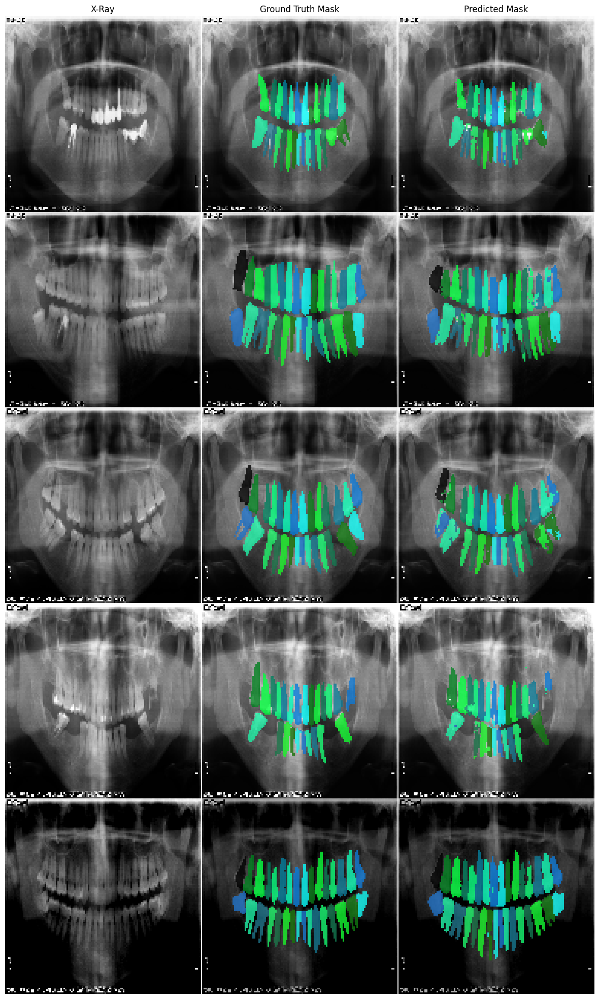

# DentSeg / Dental Segmentation with a Flexible U-Net

This document is also available in [日本語](README.jp.md)

## Description

This project showcases the segmentation of dental X-ray imagery using a PyTorch implementation of a flexible U-Net architecture. It introduces the capability to operate in Half U-Net mode, as detailed in the paper ["Half U-Net: A Simplified U-Net Architecture for Medical Image Segmentation"](https://www.frontiersin.org/articles/10.3389/fninf.2022.911679/full). Additionally, it incorporates variations of this structure and integrates the Ghost Module v2 concept from ["GhostNet: More Features from Cheap Operations"](https://paperswithcode.com/method/ghost-module) and "GhostNetV2: Enhance Cheap Operation with Long-Range Attention," aimed at creating extra feature layers with minimal compute requirements.

## Features

- **Self Attention**: Optional Self attention offers vastly improved performance and reduced training requirements at cost of increased vram requirements.
- **Ghost Module Integration**: Can be configured to use "cheap operations" to generate additional feature layers, making computational savings. Not compatible with Self Attention.
- **Configurable Channels**: Offers the option to fix channels throughout the U-Net, adhering to the methodologies proposed by the Half U-Net paper.

## Example results




## Dataset

The dental X-ray image dataset used in training was sourced from [Humans in the Loop Dental x-ray imagery](https://www.kaggle.com/datasets/humansintheloop/teeth-segmentation-on-dental-x-ray-images)

A slimmed down [archive](dentseg_dataset.tar.gz) of the dataset is provided. 

## Installation

### From Source

1. Clone the repository to your local machine:
```
git clone https://github.com/alyxking/dentseg.git
```

2. Navigate to the project directory:
```
cd dentseg
```

3. Ensure required dependencies as detailed in `requirements.txt` are installed. Or, run from the container environment as follows.

### From Container

1. Pull the docker image
```
docker pull ghcr.io/alyxking/dentseg:tag
```
2. Extract the dataset archive

2. Run the container (set DATASET_HOST_PATH and SRC_HOST_PATH)
```
docker run --rm --gpus all \
  -v "DATASET_HOST_PATH:/app/dataset" \
  -v "SRC_HOST_PATH:/app/src" \
  -p "80:80" \
  -p "8888:8888" \
  --name dentseg dentseg \
  jupyter notebook --ip 0.0.0.0 --no-browser --allow-root
```

## Usage

The DentSeg model can be configured and run with various parameters to suit your dataset and training requirements. Default values and available options are outlined as follows.

### Configuration Parameters

To configure and run the model, you can use the following command-line arguments:

* **<code>--run_name</code></strong> (default: <code>DentSeg7</code>): Set the name of the run.
* <strong><code>--epochs</code></strong> (default: <code>10</code>): Specify the number of epochs for training.
* <strong><code>--batch_size</code></strong> (default: <code>25</code>): Set the batch size for training.
* <strong><code>--image_size</code></strong> (default: <code>256</code>): Define the input image size.
* <strong><code>--dataset_path</code></strong> (default: <code>/app/dataset</code>): Provide the path to the dataset. The path should include both images and annotations.
* <strong><code>--device</code></strong> (default: <code>cuda:0</code>): Choose the device for training (e.g., <code>'cuda:0'</code>).
* <strong><code>--lossfunc</code></strong> (default: <code>DICEBCE</code>): Select the loss function for training. Refer to the available loss functions above.
* <strong><code>--evalfunc</code></strong> (default: <code>IOU</code>): Choose the evaluation function to assess model performance.
* <strong><code>--lr</code></strong> (default: <code>1e-4</code>): Set the learning rate.
* <strong><code>--layers</code></strong> (default: <code>4</code>): Set the number of layers in the U-Net model.
* <strong><code>--in_c</code></strong> (default: <code>1</code>): Specify the number of input channels.
* <strong><code>--out_c</code></strong> (default: <code>1</code>): Specify the number of output channels.
* <strong><code>--out_t</code></strong> (default: <code>mask</code>): Set the output type for the model (mask, proba, f-mask). A proba model must be specified to use f-mask. If specified proba model is used to mitigate double masking of teeth, filtering the mask layers.
* <strong><code>--flat</code></strong>: Use this flag to opt for a half U-Net unified channel width. The absence of this flag defaults to the standard U-Net channel doubling with each down step.
* <strong><code>--ghost</code></strong> (default: <code>0</code>): Activate ghost module layers. Not recommended to use with --sa flag. This is an ON/OFF flag; include it in your command to turn it ON.
* <strong><code>--sa</code></strong> (default: <code>1</code>): Activate self attention layers (improves model performance at high memory consumption cost). This is an ON/OFF flag; include it in your command to turn it ON.
  
### **Model Loading Configuration Parameters**

Further customize the model setup with these additional parameters:

* <strong><code>--load_model</code></strong>: Use this flag to enable loading a pre-trained model before starting the training process. This is an ON/OFF flag; include it in your command to turn it ON. Model parameter arguments will be ignored and previously trained model structure used in most cases.
* <strong><code>--model_name</code></strong> (default: <code>None</code>): If you're loading a pre-trained model and it has a different name from the <code>run_name</code>, specify the model's name with this argument. This is particularly useful when you wish to continue training from a previously saved model state or evaluate a pre-trained model.
* <strong><code>--proba_model_name</code></strong>: Specify a pre-trained proba model to use in f-mask(code is configured to finetune and use a resnet-50 model). First train a proba model with <code>--out_t proba</code>.
* <strong><code>--eval</code></strong>: This flag sets the model to eval mode only, training is skipped and only testing is carried out on the dataset.
* <strong><code>--full_model</code></strong>: This flag controls how the model is loaded. By default, the model loading mechanism expects a state dictionary. If your saved model includes more complex structures (e.g., optimizers, schedulers), use this flag to load the full model. This is an ON/OFF flag; include it in your command to turn it ON.


#### Example Command

To run train/evaluate from CLI, use a command similar to the following example:

```

python dentsegdataset.py --run_name DentSeg5 --epochs 200 --batch_size 4 --image_size 128 --dataset_path /path/to/the/dataset --device cuda:0 --lossfunc DICEBCE --evalfunc IOU --lr 0.0001 --in_c 3 --out_c 3 --flat

```

#### Available Loss Functions

The model supports a variety of loss functions for training and evaluation:

* **BCE:** Weighted Binary Cross-Entropy Loss
* **IOU:** Intersection Over Union Loss
* **DICE:** Dice Loss
* **DICEBCE:** Combination of Dice and BCE Loss
* **FOCAL:** Focal Loss
* **TVERSKY:** Tversky Loss
* **FOCALTVERSKY:** Focal Tversky Loss
* **DISCLOSS:** Compound discriminative Loss (for multi-instance segmentation only)
* **BCE_PROBA:** Unweighted BCE loss for training proba model
* **FILTERLOSS:** Five component compound loss for use with f-mask mode
* **MSE:** Mean squared error loss 


### Running from container:

Run from the included ipynb notebook, or add configuration commands to the docker command/ enter terminal inside container.

## License

This project is licensed under the GNU General Public License v3.0 - see the [LICENSE](LICENSE) file for details.

## Acknowledgments

This project was based on the architecture from the papers on Half U-Net architecture and GhostNet technologies. Training was performed on the Humans in the Loop dental x-ray imagery dataset.

## References

```
@dataset{HumansInTheLoop2023,
  author       = {Humans In The Loop},
  title        = {{Teeth Segmentation on dental X-ray images}},
  year         = 2023,
  publisher    = {Kaggle},
  version      = {1},
  doi          = {10.34740/KAGGLE/DSV/5884500},
  url          = {https://www.kaggle.com/datasets/humansintheloop/teeth-segmentation-on-dental-xray-images}
}
```
```
@article{LuHaoran2022,
  author       = {Lu Haoran and She Yifei and Tie Jun and Xu Shengzhou},
  title        = {{Half-UNet: A Simplified U-Net Architecture for Medical Image Segmentation}},
  journal      = {Frontiers in Neuroinformatics},
  volume       = {16},
  year         = 2022,
  doi          = {10.3389/fninf.2022.911679},
  url          = {https://www.frontiersin.org/articles/10.3389/fninf.2022.911679},
  issn         = {1662-5196}
}
```
```
@article{Han2020GhostNet,
  author       = {Kai Han and Yunhe Wang and Qi Tian and Jianyuan Guo and Chunjing Xu and Chang Xu},
  title        = {{GhostNet: More Features from Cheap Operations}},
  year         = 2020,
  eprint       = {1911.11907},
  archivePrefix= {arXiv},
  primaryClass = {cs.CV},
  url          = {https://arxiv.org/abs/1911.11907}
}
```
